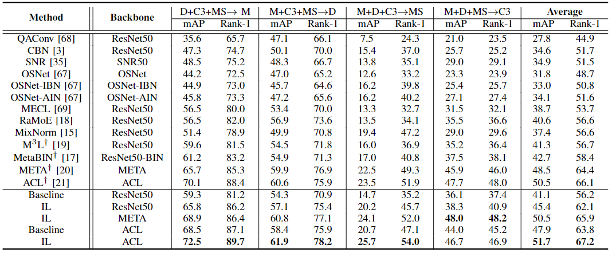
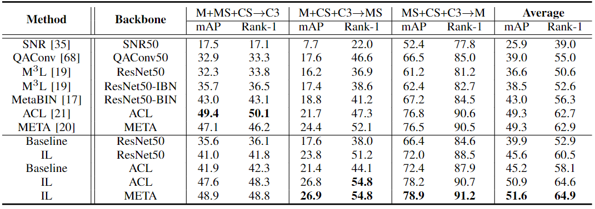

## [Style Interleaved Learning for Generalizable Person Re-identification](https://arxiv.org/abs/2207.03132) (TMM 2023)

<!-- ### Introduction
This is the Pytorch implementation for M<sup>3</sup>L. -->


 
### Requirements

- CUDA>=10.0
- At least four 1080-Ti GPUs 
- Training Data

  The model is trained and evaluated on [Market-1501](https://drive.google.com/file/d/0B8-rUzbwVRk0c054eEozWG9COHM/view), [DukeMTMC-reID](https://drive.google.com/file/d/1jjE85dRCMOgRtvJ5RQV9-Afs-2_5dY3O/view), [MSMT17_V1](https://www.pkuvmc.com/dataset.html), [CUHK03](https://drive.google.com/file/d/1ILKiSthHm_XVeRQU2ThWNDVSO7lKWAZ_/view?usp=sharing), [CUHK-SYSU](https://github.com/ShuangLI59/person_search).


  Unzip all datasets and ensure the file structure is as follow:
   
   ```
   data    
   │
   └─── market1501 / dukemtmc / cuhk03 / msmt17v1 / cuhk_sysu
        │   
        └───  Market-1501-v15.09.15 / DukeMTMC-reID / cuhk03_release / MSMT17_V1 / CUHK-SYSU
   ```

  </b>

### Run
```
ARCH=resnet50
SRC1/SRC2/SRC3=market1501/dukemtmc/cuhk03/msmt17v1/cuhk_sysu
TARGET=market1501/dukemtmc/cuhk03/msmt17v1

# train baseline
CUDA_VISIBLE_DEVICES=0,1,2,3 python main.py \
-a resnet50 -b 64 --test-batch-size 256 --iters 200 --lr 3.5e-4 --epoch 70 \
--dataset_src1 msmt17v1 --dataset_src2 cuhk03 --dataset_src3 market1501 -d dukemtmc \
--logs-dir logs/Baseline \
--data-dir DATA_PATH

# train IL
CUDA_VISIBLE_DEVICES=0,1,2,3 python main.py \
-a resnet50 -b 64 --test-batch-size 256 --iters 200 --lr 3.5e-4 --epoch 70 \
--dataset_src1 msmt17v1 --dataset_src2 cuhk03 --dataset_src3 market1501 -d dukemtmc \
--logs-dir logs/IL \
--updateStyle \
--data-dir DATA_PATH

```

 *Note:* 
 
(1) The baseline setting in this code can be denoted as 'FBF' baseline, which is different with the reported 'FB' baseline in the paper. 
    But they are similar in performance:
    
    ------------------------------------------------------------
    |Baseline|→M       |→D       |→MS      |→C3      |Avg      |
    |FB      |59.3/81.2|54.3/70.9|14.7/35.2|36.1/37.4|41.1/56.2|
    |FBF     |59.7/81.5|53.6/73.0|13.7/33.4|35.3/35.9|40.6/56.0|
    ------------------------------------------------------------
    
 (2) Just simply set '--updateStyle' can activate the interleaved learning.


### Results




### Acknowledgments
This repo borrows partially from [M3L](https://github.com/HeliosZhao/M3L/tree/master).

### Citation
```
@article{tan2023style,
  title={Style Interleaved Learning for Generalizable Person Re-identification},
  author={Tan, Wentao and Ding, Changxing and Wang, Pengfei and Gong, Mingming and Jia, Kui},
  journal={IEEE Transactions on Multimedia},
  year={2023},
  publisher={IEEE}
}
```

### Contact
Email: ftwentaotan@mail.scut.edu.cn or 731584671@qq.com
